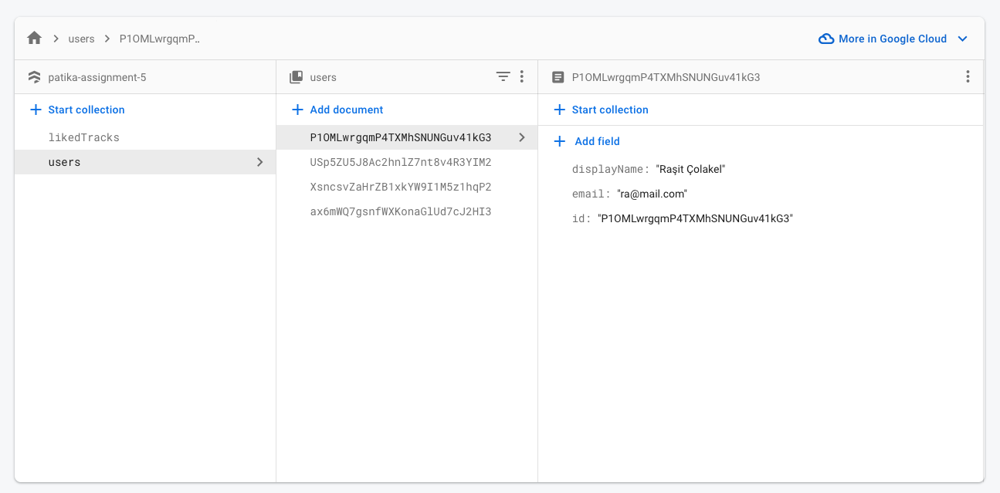
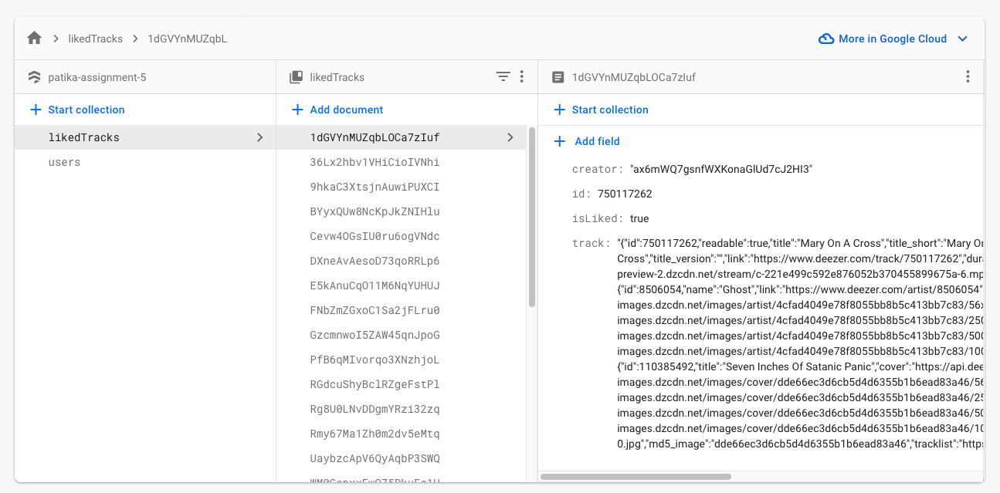
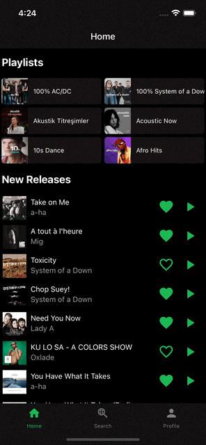
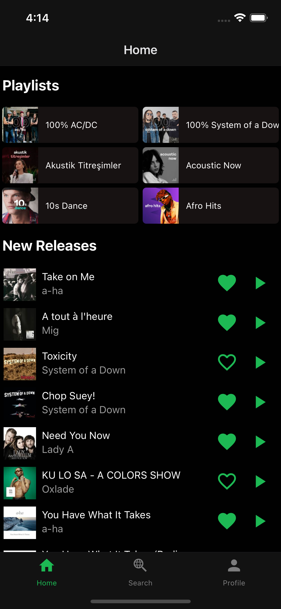
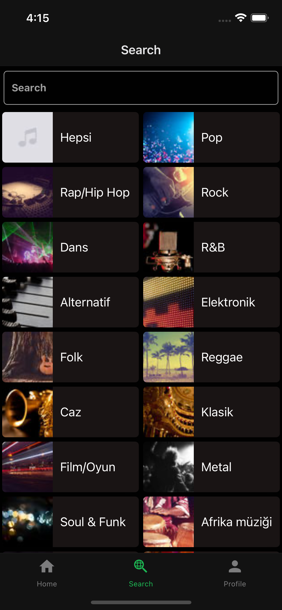
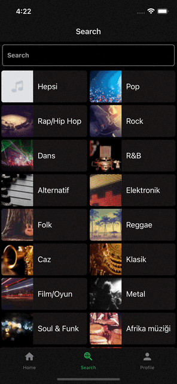
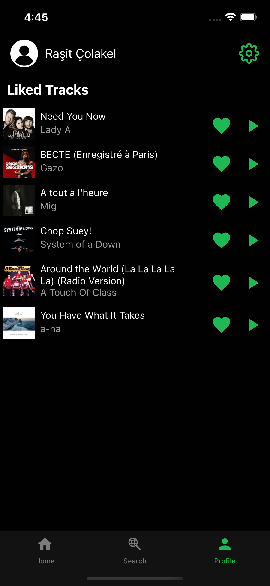

[](https://classroom.github.com/online_ide?assignment_repo_id=8442325&assignment_repo_type=AssignmentRepo)

# Patika Assignment 5

This React Native Project created with expo-typescript template

```bash
npx expo-cli init assignment5 --template expo-template-blank-typescript
```

What I have learned and used in this assignment:

- Firabase
- React Native
- Expo
- TypeScript
- React Navigation
- React Native Paper
- React Native Vector Icons
- Expo Vector Icons
- React Native Reanimated
- React Native Screens
- Expo FileSystem
- Expo Secure Store
- Expo Audio

## Description

This project is a simple music player. It has a list of songs and a player screen. The player screen has a play/pause button, a slider to change the current time of the song, a slider to change the volume of the song, and a button to go back to the list of songs.

### Storing data

When a user registers, the data is stored in Firebase. When a user logs in, the user's data is retrieved from Firebase. I fetch the tracks, playlists, and albums from [Deezer Api](https://developers.deezer.com/api) and store them the redux store. When a user likes a song, the song is stored in the user's data in Firebase. When a user logs in, the liked songs are retrieved from Firebase and stored in the redux store. There is an illustration of the flow below.


### **Users Collection**



### **LikedTracks Collection**



# Previews

**(Animated)** Audio Player And Animations [Preview](./screenshots/dark/player.gif)


**(Animated)** Playlist Screen [Preview](./screenshots/dark/playlist.gif)



Home



Search Screen



**(Animated)** Search Screen [Preview](./screenshots/dark/search.gif)


**(Animated)** Genres Screen [Preview](./screenshots/dark/genres.gif)



Profile Screen



## Installing Some Packages

These packages are required for this project. You need to install them

```bash
expo install react-native-screens
expo install react-native-gesture-handler
expo install react-native-reanimated
expo install react-native-safe-area-context
expo install @react-native-community/masked-view
```

## How to run

```bash
# install dependencies
yarn
# run the app
yarn start
# or ios simulator
yarn ios
# or android simulator
yarn android
```

## How to install Firebase

```bash
yarn add firebase
```

### How to add Firebase to your project

1. Go to [Firebase Console](https://console.firebase.google.com/)
2. Create a new project
3. Go to Project Settings
4. Go to the "Your Apps" tab
5. Click on "Add Firebase to your web app"
6. Copy the config object
7. Create a new file named "firebase.ts" where you will store your firebase configurations
8. Paste the config object into the file
9. Import the config object into the "App.tsx" file
10. Initialize Firebase with the config object

**There is an example of the firebase.ts file**

```typescript
import firebase from 'firebase/app';
import 'firebase/auth';
import 'firebase/firestore';

const firebaseConfig = {
  apiKey: '',
  authDomain: '',
  projectId: '',
  storageBucket: '',
  messagingSenderId: '',
  appId: '',
  measurementId: '',
};
// Initialize Firebase
export const app = initializeApp(firebaseConfig);

// Initialize Firebase Auth to use signup and login
export const auth = getAuth(app);

// Initialize Firebase firestore to use database
export const db = getFirestore(app);
```

### Ho to use Firebase

```typescript
import { createUserWithEmailAndPassword, signInWithEmailAndPassword } from 'firebase/auth';

import { auth, db } from '../firebase';

// signup
const signup = async (email: string, password: string) => {
  try {
    const userCredential = await createUserWithEmailAndPassword(auth, email, password);
    return userCredential;
  } catch (error) {
    return error;
  }
};

// login
const login = async (email: string, password: string) => {
  try {
    const userCredential = await signInWithEmailAndPassword(auth, email, password);
    return userCredential;
  } catch (error) {
    return error;
  }
};

// logout

const logout = async () => {
  try {
    await auth.signOut(auth);
  } catch (error) {
    return error;
  }
};
```

## How to manipulate data in Firebase

```typescript
import {
  addDoc,
  collection,
  deleteDoc,
  doc,
  getDocs,
  query,
  updateDoc,
  where,
} from 'firebase/firestore';

import { db } from '../firebase';

// add data
const addData = async (collectionName: string, data: any) => {
  try {
    const docRef = await addDoc(collection(db, collectionName), data);
    return docRef;
  } catch (error) {
    return error;
  }
};

// get data
const getData = async (collectionName: string) => {
  try {
    const querySnapshot = await getDocs(collection(db, collectionName));
    return querySnapshot;
  } catch (error) {
    return error;
  }
};

// get data with where
const getDataWithWhere = async (
  collectionName: string,
  field: string,
  operator: any,
  value: any,
) => {
  try {
    const q = query(collection(db, collectionName), where(field, operator, value));
    const querySnapshot = await getDocs(q);
    return querySnapshot;
  } catch (error) {
    return error;
  }
};

// update data
const updateData = async (collectionName: string, id: string, data: any) => {
  try {
    const docRef = doc(db, collectionName, id);
    await updateDoc(docRef, data);
  } catch (error) {
    return error;
  }
};

// delete data

const deleteData = async (collectionName: string, id: string) => {
  try {
    const docRef = doc(db, collectionName, id);
    await deleteDoc(docRef);
  } catch (error) {
    return error;
  }
};
```

## How to use Redux

```bash

yarn add redux react-redux @reduxjs/toolkit

```

### How to use Redux Toolkit

```typescript
import { configureStore } from '@reduxjs/toolkit';

import authReducer from './authSlice';
import playerReducer from './playerSlice';

const store = configureStore({
  reducer: {
    auth: authReducer,
    player: playerReducer,
  },
});

export default store;
```

## How to install React Navigation

```bash
yarn add @react-navigation/native
yarn add @react-navigation/stack
yarn add @react-navigation/bottom-tabs
```

## How To Install and use Expo File System

```bash
expo install expo-file-system
```

**Checking if the file exis**ts

```typescript
const getInfo = await FileSystem.getInfoAsync(FileSystem.documentDirectory + fileName);

if (getInfo.exists) {
  console.log('file exists');
} else {
  console.log('file does not exist');
}
```

**Downloading a fi**le

```typescript
const download = await FileSystem.downloadAsync(
  track.preview,
  FileSystem.documentDirectory + fileName,
);

if (download.status === 200) {
  console.log('downloaded');
} else {
  console.log('not downloaded');
}
```

## How To Install and use Expo Secure Store

```bash
expo install expo-secure-store
```

**Setting a val**ue

```typescript
await SecureStore.setItemAsync('token', token);
```

**Getting a val**ue

```typescript
const token = await SecureStore.getItemAsync('token');
```

**Deleting a val**ue

```typescript
await SecureStore.deleteItemAsync('token');
```

## How To Install and use Expo Audio

```bash
expo install expo-av
```

**Playing a sou**nd

```typescript
const sound = new Audio.Sound();

await sound.loadAsync({ uri: fileUri });

await sound.playAsync();
```

**Pausing a sou**nd

```typescript
await sound.pauseAsync();
```

**Stopping a sou**nd

We can stop a sound by pausing it.

```typescript
await sound.stopAsync();
```

**Unloading a sound**

We need to unload the sound when we are done with it.

```typescript
await sound.unloadAsync();
```

## How To Install and use React Native Reanimated

```bash
expo install react-native-reanimated
```

**Creating a value**

```typescript
const value = useSharedValue(0);
```

**Animating a value**

```typescript
// Creating animated style
const animation = useAnimatedStyle(() => {
  return {
    transform: [{ translateY: withTiming(value.value) }],
  };
});

// usage in a component
return (
  <Animated.View style={[styles.box, animation]}>
    <Text>Animated Box</Text>
  </Animated.View>
);
```
